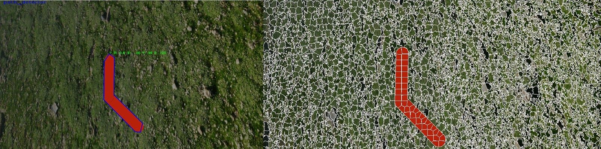
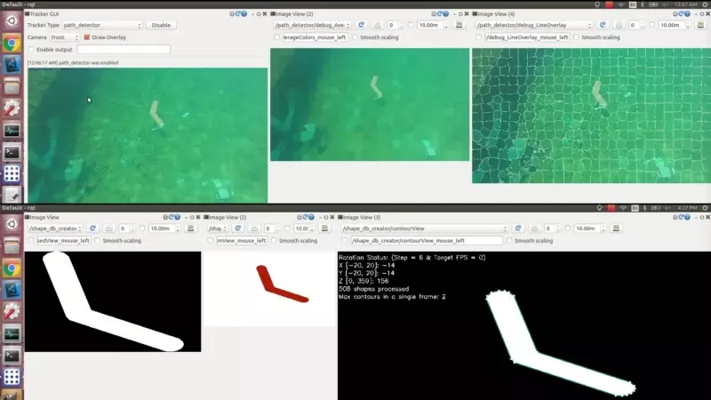

# Shape Matcher

This is a subset of [ARVP's](arvp.org) computer vision subsystem from 2019. It contains a classical computer vision algorithm that detects shapes using contrast properties of underwater images and shape priors.

Index
* [OpenCV](#opencv--cuda)
* [Superpixel Image Segmentation (gSLICr)](#superpixel-image-segmentation-gslicr)
* [Automatic Filter](#automatic-filter)
* [Qualification Detectors](#qualification-detectors)
* [Shape Database Creator](#shape-db-creator)
* [Shape Matcher](#shape-matcher)

## OpenCV / CUDA

The vision library is configured to download OpenCV 3.3.1 and compile it for CUDA support. Though the tracker GUI will list detectors, if the vision library is not compiled with CUDA support, detectors requiring CUDA will not be built. The shape DB creator is also unavailable without CUDA. OpenCV is built to the "catkin_ws/build_external" folder so that it is not easily deleted (since its kernels take a while to compile).

Use at least CUDA 10.X since CUDA 9.X and earlier require GCC/G++-6 or earlier.

## [Superpixel Image Segmentation](https://docs.google.com/document/d/1S_obWjfPqkI1xsj9CWjRCkdUNJaTfv0qC-ndoh6PBR0/edit#heading=h.7akbkhvrmhu1) (gSLICr)

This is an external library: https://github.com/carlren/gSLICr

gSLICr is used to reduce the complexity of an image by grouping regions of similar color (these regions are called superpixels).

The configuration is embedded in each individual detector's .yaml file (except the qualifications detectors use the same .yaml).
This configuration file is used by any detectors that utilize the SuperPixelFilter class, which is used to bridge gSLICr with the rest of the vision library.

These are the settings:

### gSLICr Settings

Filter Dimensions (input images will be resized to this, potentially increasing GPU load)
  
* gSLICr_width: 1920 (int)
* gSLICr_height: 1080 (int)

These parameters significantly affect the filter's range. Split segments can be joined using the automatic filter.
  
* gSLICr_noSegs: 2000 (int) (**will segfault if set to 400**) - Higher means less distortions but also a higher chance that contours will be split
* gSLICr_spixelSize: 16 (int) - hint for gSLICr, it will not necessarily use this number. Only one of gSLICr_noSegs and gSLICr_spixelSize may be used
* gSLICr_sizeInsteadOfNumber: 0 (int: 0 or 1) - use a target size instead of number of pixels

To detect smaller shapes, decrease 'gSLICr_noSegs'. This will reduce splitting of larger contours. Split contours cannot be used for detections.

Superpixel connectivity should always be set to true because only closed contours can result in detections.
 
* gSLICr_cohWeight: 0.6 (double) - the factor of much the squared L1 distance between pixels and superpixels when grouping. Setting this higher will reduce the likelihood of distant pixels being added to superpixels.
* gSLICr_noIters: 5 (int) - how many times gSLICr updates superpixel centers. Higher means more computations but better accuracy. There are diminishing returns.
* gSLICr_doEnforceConnectivity: true (boolean)

### Performance

* gSLICr is the biggest load in the detection chain. (GPU heavy)
* since gSLICr instances are not shared between shape detectors, memory usage is proportional to the resolution and number of instances.

### Debug Image Topics

The superpixel filter is implemented as a utility class. It does not have its own debug topics.

## [Automatic Filter](https://docs.google.com/document/d/14jtieKie-VdDFGFD33zAzqk0EjsogXXo8KFL7570wJk/edit)

There are two versions of the automatic filter: one for "color analysis" (old version / for qualification detectors) and one for "shape analysis" (newer version / for shape matcher). This documentation refers to the newer version.

The automatic filter is chained after superpixel image segmentation in order to group split superpixels and also to convert the image into a gray mask. Edge detection is run on this gray mask in order to find contours.

Ideally, gSLICr should be set with a low enough number of segments that minimal contour separation occurs, then the automatic filter should be used with a medium number of bins such that it will fix separations but not aggressively.

It is important to note that the automatic filter does not combine split superpixels based on proximity. Instead, divides the AB channels of a CIELAB
image into a grid, assigning colors inside of each square to a single grey value (it partitions the color space). Since only the AB channels are considered by the general algorithm, black and white are grouped based on L1 distance to their CIELAB values. 

### Automatic Filter Settings

Each detector has a .yaml file that configures the automatic filter for its specific goals (with the exception of the qualification detectors)

* shape_detector_auto_filter_bins: 100 (unsigned char) - the number of bins to partition the CIELAB AB channels into
* shape_detector_auto_filter_black_margin: 30 (unsigned char) - the maximum L1 distance (per channel) from CIELAB black for colors to be considered black
* shape_detector_auto_filter_white_margin: 30 (unsigned char) - the maximum L1 distance (per channel) from CIELAB white for colors to be considered white

### Debug Image Topics

The automatic filter is implemented as a utility class. It does not have its own debug topics.

### Performance

* The automatic filter is a relatively low load. (CPU heavy)

## [Qualification Detectors](https://docs.google.com/document/d/1GmmPfCVJnz3gBeASOMX9VwPkXvXWj9p3VMcPonEPcpA/edit#)

These are the detectors designed to detect the gate and post for the RoboSub 2018 qualification task. Significant work should not be put into these detectors as they are to be superseded by the shape matcher.

In the detector handler, their names are:
  qualification_gate_detector
  qualification_post_detector

### Qualification Detectors Settings

The settings for both qualification detectors are in the same file.

The LAB settings are the target color in the CIE LAB gamut. The margin is added and subtracted to the LAB settings to create a uniformly distanced window from the LAB target.

The 'auto filter on' setting decides whether to use the old version of the automatic filter or simple thresholding. The bins settings are as described in the automatic filter description.

The column removal error also applies to row removal. It refers to the maximum L1 distance a row / column's pixel count can be from the average row / column pixel count and not be wiped. This is used mostly for the qualification gate detector to erase the top bar, reducing the problem of detecting the gate to locating two upright posts.

qualificationDetectors_L: 40 (unsigned char)
qualificationDetectors_A: 160 (unsigned char)
qualificationDetectors_B: 255 (unsigned char)
qualificationDetectors_Margin: 50 (int)
qualificationDetectors_AutoFilterOn: true (boolean)
qualificationDetectors_AutoFilterBins: 64 (int)
qualificationDetectors_ColRemovalError: -65 (int) - this is added to the average col/row size so may be set negative. cols/rows greater than the adjusted mean are deleted

### Debug Image Topics

* debug_GraySuperPixels
* debug_LineOverlay
* debug_AverageColors
* debug_SimpleThresholdMask
* debug_ContourInputStage
* debug_AutoFilterMask
* debug_AutoFilterHistogram

The gray super pixels topic will show gSLICr's native output, which is a mask with multiple grays, where each gray uniquely corresponds to a single superpixel.

The line overlay topic will show gSLICr's native wireframe overlay on the color input image. It is useful for ensuring that gSLICr is correctly outlining objects.

The average colors topic will show each superpixel colored with the average of all pixels within each respective superpixel.

The simple threshold mask topic will be empty if simple thresholding is not enabled. Otherwise it shows the binary mask resulting from simple thresholding the input image.

The contour input stage topic will show found contours before they are culled. This is useful for tuning the minimum area threshold.

The auto filter mask topic will be empty if the auto filter is not enabled. Otherwise it shows a mask with multiple grays, where each gray corresponds to a cluster within the auto filter histogram.

The auto filter histogram topic will be empty if the auto filter is not enabled. Otherwise it shows a 2D histogram with the AB components of the CIE LAB color space. Empty histogram squares are indicated with a smaller red square. Filled histogram squares are indicated with a smaller blue square, but their shade will also range from black to white, where white indicates a larger number of pixels.

### Performance

The qualification detectors are rather slow.

## [Shape DB Creator](https://docs.google.com/document/d/1EHzh1h5DGaNLmPUfLZuOxqKJJGOFySl8--2vWqHwstQ/edit)

The shape DB creator is used to generate .sa files which are then fed into the shape matcher. DB files are plain text, so care should be taken to minimize the number of contours placed into the DB to avoid very large files.

The shape DB creator accepts a model (.3ds, etc.) on the "model" parameter. It will use this model along with the shape_db_creator.yaml file to render the model at varying angles, generating contours which can be later loaded to matching. It also accepts a "db" parameter to select the correct configuration namespace out of those declared in separate .yaml files and linked to the shape DB creator's launch file.

Note that the shape DB creator will not remove duplicate contours from generated DBs. For this reason it is up to the user to ensure that grabbed contours are mostly unique.

If an interrupt is sent to the DB creator during processing, the DB will stop rendering and will try to save what it has so far. Though, for larger DBs, it is likely that SIGTERM will be sent before saving finishes.

New DBs will always be written to "/au_vision/shape_dbs/newDB.sa". The DB creator will silently overwrite this file if it already exists.

### Shape DB Creator Settings

Multiple shape DB creator .yaml files can be created so long as their parameters are placed in a namespace "mydetector_db_creator" where 'mydetector' is the name passed to the 'db' argument. E.g. the creator can be called with a specific configuration like so:   `roslaunch shape_db_creator db:="mydetector" model:="path"`

The frame buffer dimensions are the render viewport size, as well as the window that contours are maximized within for area differencing (maintaining aspect ratio). The frame buffer is divided into a grid, where the area a shape fills each grid square is stored so that areas can be calculated much faster in a rough way by subtracting the area that two shapes fill a grid square. This is rather than rendering both shapes and doing a pixel-wise subtraction. Since the frame buffer is divided into a grid, the square size must divide the frame buffer dimensions evenly.

* FrameBufferWidth: 1920 (int)
* FrameBufferHeight: 1080 (int)
* SquareSize: 12 (int)

The name string is the tag that will be added to the final matched ROI (not the parts in the case of multi-contour objects). The render distance is used for distance approximation. It should be an arbitrary value decided to be the the distance between the render camera and the model. Parts are never named for multi-contour objects, but can be differentiated based on their color where necessary.

* Name: path (string)
* RenderDistance: 10.0 (double)

* Fps: 0 (int) - the maximum rendering framerate (0 means as fast as possible)
* gSLICrOn: false (boolean) - whether or not to use gSLICr before capturing contours - this will greatly slow the DB generation process but colors assigned to DB shapes can have a potentially large variance if this is turned off. If using color culling, turn this on.
* ContourLinearizationEpsilon: 3.0 (double) - setting this higher will reduce the number of points in contours, turning arcs into straight lines. Setting this higher will greatly reduce DB size. For optimal matching, this should be set similarly to the setting used in the shape matcher.
* MinimumContourArea: 1500 (int) - used to cull contours that are too small. This is useful for objects that have small holes in them, for example.

The following parameters are used to change the initial model pose in case there is difficulty in setting up the actual model defaults, for example, if setting the origin accurately is difficult, or if the default orientation is undesired.

* RelativeTranslateX: 0 (double)
* RelativeTranslateY: 0 (double)
* RelativeTranslateZ: 0 (double)
* UniformScale: 1 (double)
* InitialRotX: 0 (double)
* InitialRotY: 0 (double)
* InitialRotZ: 0 (double)

These parameters decide what orientations to grab contours from. The start and end rotations on each axis cannot be the same. Any of these values can be negative except for the rotation step. The rotation step decides how often the renderer will grab contours within the passed axii ranges. It should not be set too low since this will greatly increase the load on the real time renderer in the shape matcher, since there will be many more potential shapes for each real time contour that need to have a fine area (pixel-wise) area difference taken. However, if the rotation step is set too high, the area difference tolerance in the shape matcher will need to be increased, potentially causing false positives. If the rotation of matches are used, setting the rotate step lower will give more accurate angles.

Note that degrees are used over radians. This is for easier looping within the DB creator as well as to make debug output visuals more intuitive.

* StartRotateX: -20 (int)
* EndRotateX: 20 (int)
* StartRotateY: -20 (int)
* EndRotateY: 20 (int)
* StartRotateZ: 0 (int)
* EndRotateZ: 359 (int)
* RotateStep: 6 (int)

The shape DB creator does not use the automatic filter since DB results need to be very accurate. For this reason, simple thresholding is employed. There are three filter modes: range, include, exclude.

The filter count parameter indicates how many filters to read from the .yaml file. Filter parameter names should be zero-indexed, e.g.:
Filter_0_Mode: 
Filter_1_Mode:
Etc.

If the filter count is set less than the number of filters in the .yaml file, they will be ignored.

* FilterCount: 1 (int)

The range filter mode will only find contours within the passed CIE LAB color range.

* Filter_0_Mode: range (string)
* Filter_0_LowerL: 0 (unsigned char)
* Filter_0_LowerA: 138 (unsigned char)
* Filter_0_LowerB: 138 (unsigned char)
* Filter_0_UpperL: 255 (unsigned char)
* Filter_0_UpperA: 255 (unsigned char)
* Filter_0_UpperB: 255 (unsigned char)

The include and exclude filters have a different parameter format:

* Filter_0_Mode: include (string)
* Filter_0_L: 0 (unsigned char)
* Filter_0_A: 0 (unsigned char)
* Filter_0_B: 0 (unsigned char)
* Filter_0_Margin: 0 (unsigned char)

The margin will be added and subtracted uniformly from the CIE LAB target to create a filter range. If the mode is include, only the given target will be used for contour grabbing, and all other colors will be ignored. If the mode is exclude, only the given target will be ignored, and all other colors will be used (e.g. to exclude the background color easily).

Filters of all modes will be combined. Note that filters which fully contain each other are illegal and will cause an assertion.

### Debug Image Topics

* transformView
* contourView
* contourProcessedView

The tranform view topic will show the rendered model in full color. It is useful for ensuring that the model is rendering correctly. For example, if models are exported from blender as .3ds files, but the blender model contains multiple objects, only the first object will render. This topic makes this easy to catch.

The contour view will show the current pose as well as the pose ranges, allowing the user to estimate time remaining for generation. It will also indicate the maximum number of contours per frame, which acts as a sanity check since OpenSceneGraph has a tendency to mis-render. It also draws the found contours, their points, and their masks. This is the main window to observe.

The contour processed view will show contours that have been centered and maximized (maintaining aspect ratio) within the frame buffer dimensions. This topic will appear scrambled for multi-contour models.

### Performance

The shape DB creator can create a reasonably sized DB (~500 MB) within a few minutes. The bottleneck is the renderer's speed (OpenSceneGraph).

## [Shape Matcher](https://docs.google.com/document/d/11veB_O6RGKTn0zjKASsya4Q-X121A7gLCWVsiSX9mG0/edit)

The shape matcher code is contained within the "shape_analysis" folders. It is the successor of the "color_analysis" code as it attempts to be as color invariant as possible, at the cost of requiring a more shape-based analyzing solution. The primary advantage of the shape matcher, over deep learning, is the ability to train a model in only a few minutes, meaning that our computer vision is very adaptive without requiring multiple specific detectors to be written and maintained; we can quickly get detections on new shapes simply by creating a 3D model from which to generate a DB. Too, improvements to one detector will affect all other detectors positively since there is a shared backend. The shape matcher is also useful for object decomposition in regards to manipulation tasks such as firing a torpedo opening. For example, the angle results from the shape matcher can be used to center on an opening before firing, or can be used to orient correctly on a path.

The shape matcher requires a .sa file to be generated by the shape DB creator for each of its detector types. These .sa models should be placed into the "/au_vision/shape_dbs" folder and be referenced within the necessary .yaml files.

The backend is implemented through a unified detector that accepts a string to decide which shape specific settings to load.

If shape matcher models (.sa) have been pre-generated, they will be stored on the team google drive along with their source models.

Note: when adding shape detectors, remember to edit the tracker_gui rqt plugin, detector_factory, and launch files.

Note: the colors of the model used for DB generation are saved for later use for color difference thresholding. This is why there is no target color parameter in the shape detector's settings. The colors assigned to a shape are those about the interior and exterior of its contour. If an interior or exterior color is not contained in the filter used to obtain its corresponding contour, those colors will not be used during color culling. Hence, to properly generate DB colors, make sure that the background color is not contained in any of the filters.

Note: the "filterSize" param is fixed in the function averageContourColor(). This parameter specifies the maximal "distance" inside and outside of a contour to sample its average color. If a shape is particularly thin, the algorithm average color will be wrong because of points sample outside of the contour.

Note: The pose output from a match is relative to the initial pose set in the DB creator.

### Shape Matcher Settings

The shape matcher is configured on a per detector basis. For this reason, it is necessary to nest all shape matcher parameters within a namespace. This namespace should be named exactly the same as the detector name which is used by the detector handler to call the detector.

The auto filter parameters are described in the auto filter section. Note the boolean for turning off the auto filter's histogram debug output topic. If this is set to true, a very large amount of processing time will be spent rendering the histogram image. This processing time goes up as the histogram bins go up.

* angle_path_detector: (namespace)
  * min_points: 0 - the minimum number of points a contour must have for it to be considered for a match (this actually culls contours before the match step, potentially causing a performance gain). This is useful for removing false positives if there is a known estimate for the point count in a target object.
  * max_points: 0 - the maximum number of points a contour must have for it to be considered for a match (this actually culls contours before the match step, potentially causing a performance gain). This is useful for removing false positives if there is a known estimate for the point count in a target object. Setting this to zero means there is no maximum.
  * database: new_path.sa (string) - the database to load, relative to "/au_vision/shape_dbs/"
  * minimum_contour_area: 10000 (int) - the minimum area a contour must have to be considered for matching
  * contour_linearization_epsilon: 3.0 (double) - setting this higher will simplify arcs to straight lines. This is useful in conjunction with the minPoints and maxPoints parameters.
  * area_difference_thresh: 200000 (int) - the maximum area difference a real time contour and a shape in the DB can have and still be considered associated
  * color_difference_thresh: 1000 (int) - the maximum L1 distance between a shape's real time color and its color in the DB for that shape to be considered a match. The L1 distance only considers the CIELAB AB channels (not lightness)
  * minimum_rating: 0.50 (double) - the minimum rating a group must have to be considered a match. This does not refer to the rating of individual shapes unless a group has only one shape. When a group is incomplete, its rating is calculated as the average of the shapes that do exist, and that average is compared to this parameter.
  * minimum_shape_group_ratio: 0.2 - the minimum value of (shapes found to be in group) / (possible shapes for group) in order for a group match to occur. This is useful for when a certain number of group shapes is enough to be confident about a match (for example, two triangles of the roulette)
  * auto_filter_bins: 100 (unsigned char) - must be a divisor of 255
  * auto_filter_black_margin: 30 (unsigned char)
  * auto_filter_white_margin: 30 (unsigned char)
  * auto_filter_histogram: false (boolean)

### Debug Image Topics

* debug_GraySuperPixels
* debug_LineOverlay
* debug_AverageColors
* debug_InputStageContours
* debug_AutoFilterMask
* debug_AutoFilterHistogram
* debug_BinaryMaskWithHud
* debug_Edges
* debug_AverageColorSampleRegions

The gray super pixels topic will show gSLICr's native output, which is a mask with multiple grays, where each gray uniquely corresponds to a single superpixel.

The line overlay topic will show gSLICr's native wireframe overlay on the color input image. It is useful for ensuring that gSLICr is correctly outlining objects.

The average colors topic will show each superpixel colored with the average of all pixels within each respective superpixel.

The input stage contours topic will show found contours before they are culled. This is useful for tuning the minimum area threshold.

The auto filter shows a mask with multiple grays, where each gray corresponds to a cluster within the auto filter histogram.

The auto filter histogram topic will be empty if the auto filter histogram topic is not enabled. Otherwise it shows a 2D histogram with the AB components of the CIE LAB color space. Empty histogram squares are indicated with a smaller red square. Filled histogram squares are indicated with a smaller blue square, but their shade will also range from black to white, where white indicates a larger number of pixels.

The binary mask with HUD topic will output an image displaying the contours which make it past the culling function. Red contours indicate that they were culled (did not pass some threshold). A blue contour indicates it wasn't culled, but did not match within a group. A green contour indicates it's been matched within a group. There is only ever one matched group so multiple green contours can be considered associated. The points on green and blue contours are drawn with their contour's average color (the same one used to check against the color threshold).

The edges topic will output a binary mask of the auto filter mask's edges. This is the image that is passed to OpenCV's contour finding algorithm.

The average color sample regions topic will output a binary mask showing what points are used to calculate the interior and exterior average colors for each contour.

### Performance

Let db_n be the number of contours in the DB.
Let rt_n be the number of contours in the RT frame.
Let db_gn be the number of groups in the DB.
Note that image dimensions will proportionally increase processing time, but for the sake of analysis, functions dependent on the image dimensions will be considered constant time.

The shape matcher uses the following chain of processes:
1. Convert image to LAB (GPU) O(c)
2. Unsharp mask (makes colors 'pop' for color thresholding) (CPU) O(c)
3. gSLICr (GPU) O(c)
4. Auto Filter (group split superpixels and return gray mask) (CPU) O(c)
5. Edge Detect (convert auto filter gray mask into binary mask with edges) (GPU) O(c)
6. Find contours (CPU) O(c)
7. Linearize contours (CPU) O(rt_n)
8. Cull Contours (CPU) O(rt_n)
9. Average interior and exterior contour colors (GPU) O(rt_n)
10. Matching Algorithm
    1. For each realtime contour O(rt_n)
        1. Center and maximize into frame buffer (CPU) O(c)
        2. Rough area differences of RT contour to DB contours (GPU) O(db_n)
        3. Color differences of RT contour to DB contours (GPU) (db_n)
        4. Cull DB contours based on area and color thresholds (CPU) O(db_n)
        5. Calculate fine area differences of RT contour and remaining DB contours (involves rendering RT contour) (CPU render) (CPU area comparison) O(db_n)
        6. Fill a bin corresponding to the RT contour (with the passing DB contours)
    2. Map RT contours to their single best DB contour (CPU) O(db_n)
    3. Cull DB groups for which there aren't enough RT contours to satisfy (CPU) O(db_gn)
    4. Calculate potential group matches (CPU) O(db_gn)
    5. Select the best group (CPU) O(db_gn)
        1. Estimate group distance (CPU) O(c)
        2. Estimate group bounding rectangle (considering some RT shapes may be missing) (CPU) O(c)
11. Calculate group ROI O(rt_n)

See the documentation on "Debugging / Profiling" to learn how to profile this system.

The slowest part of the system seems to be the auto filter. Try reducing its bins to trade off accuracy for speed if that’s an issue.

Note that performance is also based on the amount of concurrent GPU kernels that can be run. This is limited by VRAM as set by a constant in shape_analysis_detector_common.cpp.
